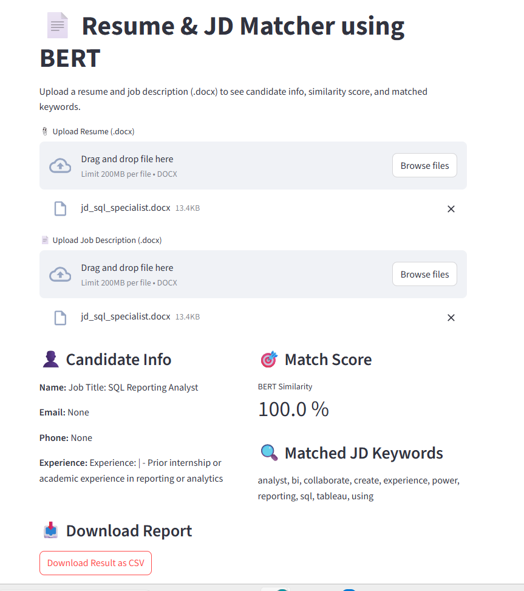

# 📄 Resume & JD Matcher with BERT

[](https://resume-parser-job-matcher-ml-nlp.streamlit.app/)


---

A smart NLP-powered Streamlit app to match resumes with job descriptions , compares them using BERT-based semantic similarity, extracts key skills, and generates a match score. Supports both `.docx` and `.pdf` formats.

---

## 🚀 Features

- 📎 Upload Resume & JD in **.docx** or **.pdf** format
- 🔍 Extract candidate info (name, email, phone, experience)
- 🤖 Compute **semantic similarity** between resume & JD using BERT
- 🎯 Highlight matched **keywords**
- 📥 Downloadable result as **CSV**
- ❌ Built-in **error handling** for unreadable PDFs

---

## 📸 Demo Screenshot



---

## 🧠 How It Works

1. Extracts text from `.docx` using `python-docx` and from `.pdf` using `pdfplumber`
2. Cleans and processes the text using custom preprocessing logic
3. Uses Sentence-BERT (`all-MiniLM-L6-v2`) to compute semantic similarity
4. Uses TF-IDF to extract the top keywords from the job description
5. Matches and highlights overlapping skills between the resume and JD
6. Displays results in a user-friendly Streamlit web app
7. Handles unreadable or image-based PDFs gracefully with error messages

---

## 🗂 Folder Structure

```
resume_parser_job_matcher/
├── app/
│ └── app.py ← Streamlit app
├── scripts/ ← Logic modules
│ ├── parse_resume.py
│ ├── job_matcher.py
│ └── text_cleaner.py
├── data/ ← Sample resumes and JDs (gitignored)
├── requirements.txt
├── LICENSE
├── .gitignore
└── README.md
├── screenshots/
  └── app_ui.png 
```


---

## 🧪 Sample Use

- Upload `resume_sample.pdf` or `resume_ml.docx` along with a matching `jd_sample.pdf` or `jd_ml_engineer.docx`
- The app will extract and display:
  - Candidate name, email, phone, and experience summary
  - Semantic similarity match score
  - Highlighted keywords from the job description that match the resume
- Download the result as a clean CSV report

---

## 🛠 Technologies Used

- Python
- Streamlit
- Sentence-Transformers (BERT)
- scikit-learn (TF-IDF, cosine)
- python-docx
- pandas
- pdfplumber

---

## 📦 Setup Instructions

1. Clone this repo

```bash
git clone https://github.com/your-username/resume_parser_job_matcher.git
cd resume_parser_job_matcher
```

2. Create virtual environment and install requirements:

```bash
python -m venv venv
venv\Scripts\activate
```

```bash
pip install -r requirements.txt
```

3. Run the app

```bash
streamlit run app/app.py
```

---

## 🌐 Live Demo

[

---

## License

This project is licensed under a custom license for **personal and educational use only**.

- ✅ You may use, modify, and share this code for learning and personal projects.
- ❌ Commercial use, resale, or offering this code as part of a paid product/service is **not allowed** without the author's permission.

To request commercial use rights, contact: hpriyavtva2001@gmail.com

---

## 🙋‍♀️ Author

Vyamsani T V A Haripriya  
Data Analyst | ML & AI Enthusiast
